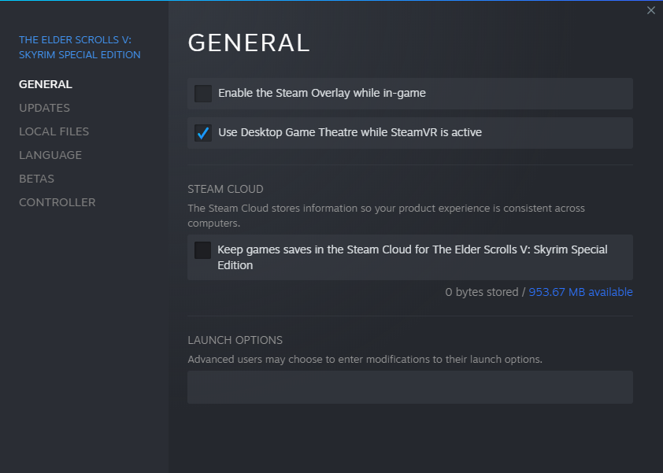
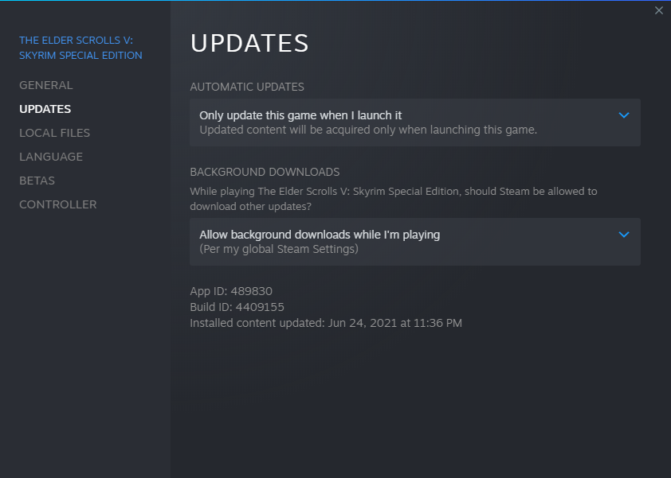
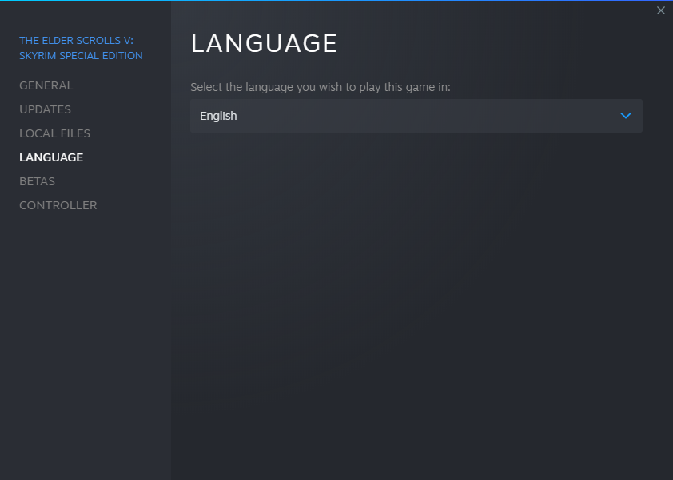
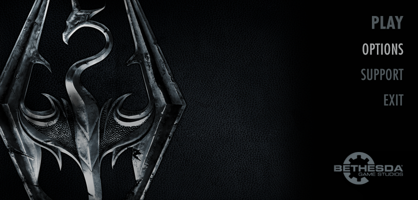
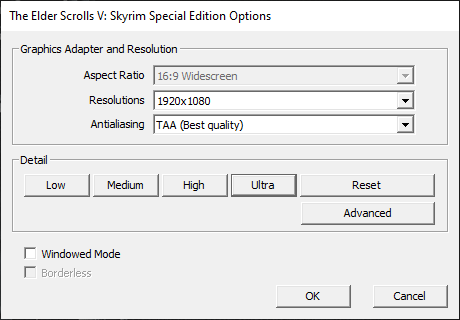
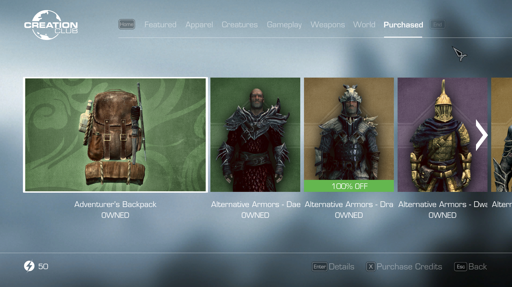

# A Touch of Frost

 This is a curated modlist designed for a more engaging, survival focused, Skyrim SE experience. It is expected that players will not add additional mods or otherwise change this modlist.

- [A Touch of Frost](#a-touch-of-frost)
- [Preamble](#preamble)
- [Installation](#installation)
  - [Pre-Installation](#pre-installation)
    - [Installing Microsoft Visual C++ Redistributable Package](#installing-microsoft-visual-c-redistributable-package)
    - [Steam Config](#steam-config)
      - [Disable the Steam Overlay](#disable-the-steam-overlay)
      - [Change Steams Update Behaviour](#change-steams-update-behaviour)
      - [Set the Game language to English](#set-the-game-language-to-english)
    - [Clean Skyrim](#clean-skyrim)
      - [Start Skyrim](#start-skyrim)
      - [Creation Club](#creation-club)
    - [Using Wabbajack](#using-wabbajack)
      - [Preparations](#preparations)
      - [Downloading and Installing](#downloading-and-installing)
      - [Problems with Wabbajack](#problems-with-wabbajack)
  - [Post-Installation](#post-installation)
    - [Copy Game Folder Files](#copy-game-folder-files)
    - [Starting the Game](#starting-the-game)
    - [Creating your Character](#creating-your-character)
- [Updating](#updating)
- [Noteworthy Mods](#noteworthy-mods)
  - [Survival and Needs](#survival-and-needs)
  - [Cities, Towns, Villages and Hamlets](#cities-towns-villages-and-hamlets)
  - [Magic, Combat and Perks](#magic-combat-and-perks)
  - [Quest and Encounter Mods](#quest-and-encounter-mods)
  - [Weapons, Armour, and Clothing](#weapons-armour-and-clothing)
  - [Stand Alone Followers](#stand-alone-followers)
  - [Player Homes](#player-homes)

# Preamble

A Touch of Frost is based upon a fairly simple premise. First, the land is a harsh, unforgiving environment, where only hardy Nords thrive. Second, the country is in the middle of a vicious civil war. Neither of which are readily apparent when you play the game. The primary purpose of this modlist is to expand upon this premise.

To do this a core installation centred around community bugfixes has been established, with a needs system based around hunger, thirst, fatigue, and warmth being a central part of the gameplay loop. Additional curated mods have been selected to further flesh out both the civil war, and Skyrim in general, giving it a feeling of being a much more alive and vibrant location.

I have created custom patches to smooth out compatibility issues between different mods, and to improve the integration of official Bethesda content into Skyrim SE.

Finally, I have created my own bespoke mods, specifically for A Touch of Frost. It is these custom patches, and supporting bespoke mods that make A Touch of Frost stand apart from similar mod lists.

# Installation

## Pre-Installation

These steps are only needed if you install this Modlist for the first time. If you update the Modlist, jump straight to [Updating](#updating).

### Installing Microsoft Visual C++ Redistributable Package

It is unlikely that you are missing this. However it is needed for MO2 and several plugins, so please download it and install it anyway from [Microsoft](https://support.microsoft.com/en-us/help/2977003/the-latest-supported-visual-c-downloads). Download the x64 version under "Visual Studio 2015, 2017 and 2019". This is [Direct link](https://aka.ms/vs/16/release/vc_redist.x64.exe) if you can't find it.

### Steam Config

#### Disable the Steam Overlay

The Steam Overlay can cause issues with ENB and is recommended to be turned off.
**Please note that this mod list does not use an ENB.**

Open the Properties window (right click the game in your Library->Properties), navigate to the _General_ tab and un-tick the _Enable the Steam Overlay while in-game_ checkbox.

#### Change Steams Update Behaviour

Skyrim SE is still being updated by Bethesda (they only add Creation Club content). Whenever the game updates, the entire modding community goes silent for the next one or two weeks because some mods need to be updated to the latest game runtime version.

To ensure that Steam does not automatically update the game for you, head over to the Properties window, navigate to the _Updates_ tab and change _Automatic updates_ to _Only update this game when I launch it_. You should also disable the Steam Cloud while you're at it.

#### Set the Game language to English

This modlist is in English, and most of the mods you find are in English. **I can not give support to people with a non-English game**.

Open the Steam Properties window, navigate to the _Language_ tab and select _English_ from the dropdown menu.

### Clean Skyrim

I highly recommend uninstalling the game through Steam, deleting the game folder and reinstalling it. You should also clean up the `Skyrim Special Edition` folder in `Documents/My Games/`. This is especially true if you have been using Nexus Mod Manager or Vortex to manage your Skyrim Mods.

#### Start Skyrim

After you have done everything above and got a clean Skyrim SE installation ready, start the Launcher and open the _Options_ menu.

1. Click on _Ultra_
2. Set the  _Resolution_ to your monitor's native values
3. Set _Antialiasing_ to _TAA_
4. **Do not** check _Windowed Mode_ and _Borderless_

Start the game and exit once you're in the main menu.

#### Creation Club

If you own any items from the Creation Club, they are not automatically reinstalled when you install Skyrim SE. To reinstall Creation Club items, you must launch the game, select the Creation Club menu option, select the purchased option, then download each Creation club item individually.

At the time of writing this document, Creation Club items are not supported in this mod list. However as I do own a lot of Creation Club content, this is subject to change in the future.

### Using Wabbajack

#### Preparations

Grab the latest release of Wabbajack from [here](https://github.com/wabbajack-tools/wabbajack/releases) and place the `Wabbajack.exe` file in a _working folder_.  The recommended working folder is `C:\WJ\WabbaJack`. This folder **must not** be in a _common folders_ like your Desktop, Downloads or Program Files folder.

#### Downloading and Installing

The download and installation process can take a very long time depending on your system specs. Wabbajack will calculate the amount of threads it will use at the start of the installation. To have the highest amount of threads and thus the fastest speed, it is advised to have the working folder on an SSD.

1. Open Wabbajack
2. Click on Browse Modlists, and download A Touch of Frost from the gallery.
3. Once the download is done set the _installation folder_. The recommended installation path is `C:\WJ\AToF`.  This folder **must not** be in a _common folders_ like your Desktop, Downloads or Program Files folder. The downloads path should automatically fill in the installation path. The rest of this document will assume you are using the recommended installation path.
4. Click the Go/Begin button
5. Wait for Wabbajack to finish
6. If you run into any issues see the next section. If the installation is successful, proceed to [Post-Installation](#post-installation).

#### Problems with Wabbajack

There are a lot of different scenarios where Wabbajack will produce an error. I recommend re-running Wabbajack before posting anything. Wabbajack will continue where it left off so you will not loose progress.

**Could not download x**:

If a mod updated and the old files were deleted, it is impossible to download them. You will need to be patent and wait for me to update the modlist.

**Wabbajack could not find my game folder**:

Wabbajack will not work with a pirated version of the game. If you own the game on Steam, go back to the [Pre-Installation](#pre-installation) step.

## Post-Installation

### Copy Game Folder Files

Copy all of the files from the `C:\WJ\AToF\Game Folder Files` directory into your game folder. Do not copy any other files.

### Starting the Game

Head over to the installation folder and locate an executable named `ModOrganizer.exe` and launch it. This will be `C:\WJ\AToF\ModOrganizer.exe` if you have followed the recommended settings. Once it is launched, there will be a dropdown box on the top right and a big run button right next to it. Ensure it is set to SKSE by selecting it in the dropdown box and then hitting the run button. You have to run SKSE through Mod Organizer 2 in order to play A Touch of Frost.

### Creating your Character

After starting a new game, you will start in the Alternate Start - Live Another Life prison cell where you can customise your character, then configure your mods before you actually start playing.

It is **very** important that you wait in this cell, until all the messages in the top left corner have finished. Now would be an excellent time to go make a cup of tea or coffee. Once these messages have finished, press `ESCAPE` and create a manual save before you continue. You can now configure mods via the MCM to your liking, and select your start. I personally prefer the Shoal's Rest Farm start.

At this point a second group of mods will begin initialising, including all installed Creation Club content.

# Updating

If this Modlist receives an update please check the [Changelog](CHANGELOG.md) before doing anything. The [Changelog](CHANGELOG.md) will advise if you will need to start a new game, or if your existing saves will continue working.

**Wabbajack will delete all files that are not part of the Modlist when updating!**

This means that any additional mods you have installed on top of the Modlist will be deleted. Your downloads folder will not be touched.

Updating is like installing. You only have to make sure that you select the same path and tick the _overwrite existing Modlist_ button.

# Noteworthy Mods

## Survival and Needs

**[SunHelm](https://www.nexusmods.com/skyrimspecialedition/mods/39414)** is an all in one survival and needs mod. This full featured, yet performance friendly mod covers Hunger, Thirst, Fatigue and Cold needs. This is one of the core mods that this mod list is built around.

**[Hunterborn](https://www.nexusmods.com/skyrimspecialedition/mods/7900)** is the most in-depth hunting mod for Skyrim. Considered by many to be the de facto hunting mod, no survival style playthrough is complete without it.

**[Campfire](https://www.nexusmods.com/skyrimspecialedition/mods/667)** is simply the best stand alone camping mod for Skyrim. Pairing well with SunHelm to ensure you can always attend to Fatigue needs, either by yourself, or with a follower or three.

**[Skills of the Wild](https://www.nexusmods.com/skyrimspecialedition/mods/37693)** brings 4 new campfire survival skills designed to complement and enhance **[Campfire](https://www.nexusmods.com/skyrimspecialedition/mods/667)**, and **[Hunterborn](https://www.nexusmods.com/skyrimspecialedition/mods/7900)**. **This mod in particular makes some significant changes such as removing the compass until you unlock that skill.**

## Cities, Towns, Villages and Hamlets

**[Dawn of Skyrim (Director's Cut) SE](https://www.nexusmods.com/skyrimspecialedition/mods/9074)**, **[JK's Skyrim](https://www.nexusmods.com/skyrimspecialedition/mods/6289)**, and **[Arthmoor's Towns and Villages](https://www.nexusmods.com/skyrimspecialedition/users/684492?tab=user+files)** have been combined together to really bring Skyrim's Cities, Towns and Villages to life. With new NPCs, shops, and a much bigger feel, cities will really feel as if they are cities, and not just glorified villages like in vanilla.

**[Obscure's College of Winterhold](https://www.nexusmods.com/skyrimspecialedition/mods/20514)** is in my opinion the best College of Winterhold overhaul available. Integrating with a variety of other mods to give a seamless, truly magical vibe to the College of Winterhold.

## Magic, Combat and Perks

**[Mysticism - A Magic Overhaul](https://www.nexusmods.com/skyrimspecialedition/mods/27839)** is the core magic overhaul, that A Touch of Frost uses. In it's author's words "Mysticism is an overhaul that fixes bugs in Vanilla spells, fills in gaps in the game's magic progression, and adds new spells from previous Elder Scrolls titles."

**[Triumvirate - Mage Archetypes](https://www.nexusmods.com/skyrimspecialedition/mods/39170)** adds 75 balanced spells divided among 5 mage archetypes (druid, shadow mage, warlock, cleric, shaman), to further flesh out the magic system.

**[Scion](https://www.nexusmods.com/skyrimspecialedition/mods/41639)** is a complete overhaul of Skyrim’s Vampire system designed to balance existing Vampire mechanics and add powerful new vampiric abilities to the game. In it's authors own words "Scion provides a minimalistic and streamlined overhaul of the four stages of Vampirism, designed to make both Stage 1 and Stage 4 desirable for different builds. It also overhauls the Vampire Lord’s level-based scaling and its perk tree to ensure that the Vampire Lord is viable throughout the late game."

**[Manbeast](https://www.nexusmods.com/skyrimspecialedition/mods/44746)** is a complete overhaul of Skyrim’s Werewolf system designed to balance existing Werewolf mechanics and add powerful new lycanthropic abilities to the game. In it's authors own words "Becoming a Werewolf has no effect on your human form, and transforming is rarely a good idea due to their low damage and their lack of healing. Manbeast addresses these and other problems by overhauling the Werewolf perk tree, adding new passives to mortal form, and introducing a forced transformation mechanic for Werewolves who try to suppress the beast within."

**[Vokrii](https://www.nexusmods.com/skyrimspecialedition/mods/26176)** is a lightweight "vanilla-plus" perk overhaul that improves build diversity, but respects the vanilla vision and balance. It is lightweight and uses clean scripting. Vokrii comes with a patch to fully support **[Mysticism - A Magic Overhaul](https://www.nexusmods.com/skyrimspecialedition/mods/27839)**.

## Quest and Encounter Mods

**[Interesting NPCs](https://www.nexusmods.com/skyrimspecialedition/mods/29194)** adds over 250 fully voiced NPCs, 25+ followers, 15+ marriage candidates, and 50+ quests to flesh out the world of Skyrim fully. Every hold will feel more lively, with more NPCs walking and talking with each other. Generally quests will start by talking to the NPCs.

**[Wyrmstooth](https://www.nexusmods.com/skyrimspecialedition/mods/45565)** adds a new quest that takes the Dragonborn to the island of Wyrmstooth situated north of Solitude across the Sea of Ghosts. Battle across new landscapes and through new dungeons in this expansion-sized mod. Will start automatically once you are Dragonborn and level 10.

**[Skyrim Sewers](https://www.nexusmods.com/skyrimspecialedition/mods/9320)** adds an accessible sewer system to the towns of Solitude, Whiterun, Windhelm and Markarth and also small sewage tunnels to Fort Sungard and Greenwall.

**[Land of Vominheim SE](https://www.nexusmods.com/skyrimspecialedition/mods/31472)** is a large archipelagic and cold land consist of Multiple island with boats on each island for easy travel. It is roughly the size of Solstheim and has dozens of locations to discover and explore. To get to this land you’ll need to head north of Dawnstar and find the Northfolk docks which can take you to Vominheim.

**[Hammet's Dungeon Packs for SE](https://www.nexusmods.com/skyrimspecialedition/mods/12186)** features 32 new dungeons and caves added to Skyrim and Solstheim and a new world space called Desolate Veil to discover and explore. These dungeons are radiant quest enabled. Recommended to bring followers along.

**[Shalidor's Migrant Portals SE](https://www.nexusmods.com/skyrimspecialedition/mods/17262)** adds a new dungeon to the Labyrinth which becomes available to explore once you've completed Shalidor's Maze. Inside is a small chamber with a new boss battle and a reward of a collection of portal stones allowing for instantaneous travel across large distances.

**[Paarthurnax - Quest Expansion](https://www.nexusmods.com/skyrimspecialedition/mods/51711)** is a fully voiced, expanded new take on the Paarthurnax quest, giving both the Blades and Paarthurnax good reasons for their stances, and you, Dragonborn, the final choice.

**[Stendarr Rising - The Hall of the Vigilant Rebuild](https://www.nexusmods.com/skyrimspecialedition/mods/49346)** The vicious vampire attack on the Vigil of Stendarr has left their Hall a smoking ruin. Take control of the destroyed Hall, clear the rubble, relight the forge and resurrect a new Hall from the ashes. Build fortified defences and recruit new Vigilants to man the ramparts and defend against vampire raids.

**[Thieves Guild Requirements SE](https://www.nexusmods.com/skyrimspecialedition/mods/33256)** dramatically changes how you interact with the thieves guild. Brynjolf will no longer automatically approach you in Riften. You won't be considered a potential recruit for the Thieves Guild unless you've actually done a bit of dirty work. This mod also adds additional requirements as you progress along the Thieves Guild quests in order to allow the story to advance at a steadier pace.

**[Dungeons - Revisited](https://www.nexusmods.com/skyrimspecialedition/mods/51798)** overhauls and enhances the vanilla dungeons Bleak Falls Barrow, Ustengrav, Embershard Mine, Steepfall Burrow, Halted Stream Camp, White River Watch, and Hillgrund's Tomb.

## Weapons, Armour, and Clothing

**[Simple Smithing Overhaul](https://www.nexusmods.com/skyrimspecialedition/mods/47115)** is a simple smithing overhaul changing recipes, adding the ability to breakdown most armour and weapons, replicate certain artefacts without their enchantments, and upgrade unique levelled weapons and armour.

**[Weapons Armor Clothing and Clutter Fixes](https://www.nexusmods.com/skyrimspecialedition/mods/18994)** and **[Armor and Clothing Extension](https://www.nexusmods.com/skyrimspecialedition/mods/19002)** is the de facto Weapon, Armour and Clothing fix pack.

## Stand Alone Followers

**[Lucien - Immersive Fully Voiced Male Follower](https://www.nexusmods.com/skyrimspecialedition/mods/20035)** - a very in depth follower. There isn't enough space here to do the description justice, so follow the link and read up about this fantastic NPC. **Do not import this follower into Nether's Follower Framework, or My Home is Your Home - you will break this NPC**.

## Player Homes

**[Silverstead (SE)](https://www.nexusmods.com/skyrimspecialedition/mods/2397)** is a large Hearthfire inspired buildable player home/small town with over 280+ build options to choose from. A **[comprehensive patch](patches/AToF_Silverstead/Data/Yagisans_AToF_Silverstead_Patch.md)** has been developed by Yagisan to reflect it's importance to A Touch of Frost as potentially the players main base of operation in Skyrim.
